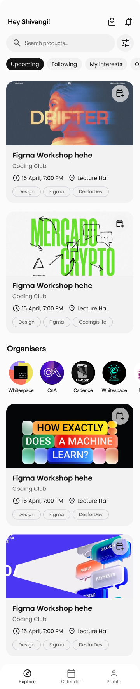
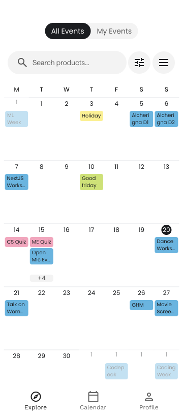
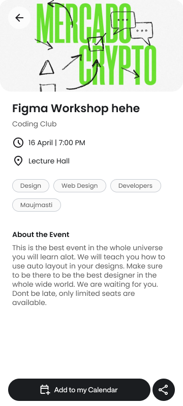
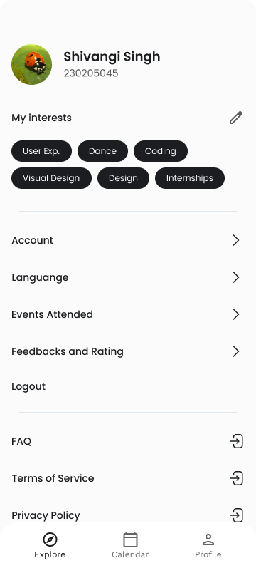

<div align="center">

  <h1>Campus Sync</h1>
  <p><strong>An all-in-one platform designed to streamline campus communication, event management, and coordination. From personalized event updates and club notifications to seamless merchandise purchases and smarter scheduling, the app keeps both students and organizers in sync.</strong></p>
  
  <!-- Badges -->
  <p>
    
    
    
    
  </p>
</div>

---

## 📱 Main Screens of the Application
> All UI mock-ups, prototypes, and event-card designs were created in Figma.

<div align="center">
  
  
  
  
</div>

---

## 📑 Table of Contents

- [🚀 Features](#-features)
- [🧑‍💻 Tech Stack](#-tech-stack)
- [🛠️ Setup Instructions](#️-setup-instructions)
- [📐 Methodology](#-methodology)
- [🎯 Future Goals](#-future-goals)
- [💡 Why Campus Sync?](#-why-campus-sync)
- [📬 Contact](#-contact)

---

## 🚀 Features

### 🔔 Real-Time Notifications
- Built using **Firebase Cloud Messaging (FCM)** and **BullMQ** (a Redis-backed queue system).
- Supports both instant and scheduled delivery for event reminders and announcements.
- Robust job processing with features like automatic retries, exponential backoff, and parallel workers to ensure reliable delivery.

### 🧠 Smart Event Coordination
- Events progress through clear states: **Draft → Tentative → Published**.
- An interactive timeline view helps organizers identify and resolve potential scheduling conflicts with overlapping events.
- Supports multi-organizer collaboration for seamless planning.

### 🧑‍🎓 Personalized User Experience
- **Club Following**: Users can follow their favorite clubs by category (e.g., Coding, Finance, Blockchain) to receive tailored updates.
- **🏷️ Personalized Feed with Tags**: Users can subscribe to interest-based tags like `#coding`, `#robotics`, or `#entrepreneurship`. Events tagged by organizers appear in the user's personalized feed, cutting through the noise.
- **Contest Alerts**: Integrates with the **Codeforces API** to send timely notifications for upcoming competitive programming contests.

### 🛍️ Payments & File Management
- **Razorpay Integration**: Secure, UPI-based payments for event tickets and club merchandise directly within the app.
- **📎 Secure File Management with OneDrive**:
  - **Authentication**: Uses the Microsoft Graph API with OAuth 2.0, allowing organizers to securely connect their OneDrive accounts.
  - **File Uploads**: Organizers can upload event-related files (posters, rulebooks, etc.) directly to a dedicated app folder in their own OneDrive.
  - **Secure Sharing**: The app stores and shares a secure, permission-based link to the file, ensuring data privacy and user control.

### 🔐 Role-Based Access Control (RBAC)
- Clearly defined roles for **Students**, **Organizers**, and **Admins**.
- Ensures users can only access the resources and permissions relevant to their role.

---

## 🧑‍💻 Tech Stack

| Layer | Technology / Service |
| :--- | :--- |
| **Frontend** | Flutter (Android + iOS) |
| **Backend** | Node.js + Express.js |
| **Database** | Firebase Firestore + Redis (for caching & queues) |
| **Notifications**| FCM + BullMQ |
| **Design** | Figma (UI/UX Prototyping) |
| **Integrations**| Microsoft Graph API (OneDrive, Outlook), Razorpay API, Codeforces API |

---

## 🛠️ Setup Instructions

### 🔧 Backend (Node.js + Express)

1.  Navigate to the `server/` directory:
    ```
    cd server
    ```
2.  Add a `.env` file with the required credentials and configurations.
3.  Start the server:
    ```
    node index.js
    ```

### 📱 Frontend (Flutter)

1.  Navigate to the `frontend/` directory:
    ```
    cd frontend
    ```
2.  **(Optional but Recommended)** Clean the build:
    ```
    flutter clean
    ```
3.  Run the app using one of the following methods:

    #### ▶️ Using VS Code (`launch.json`)
    Create or edit `.vscode/launch.json` with the following configuration:
    ```
    {
      "version": "0.2.0",
      "configurations": [
        {
          "name": "Flutter",
          "request": "launch",
          "type": "dart",
          "program": "lib/main.dart",
          "args": [
            "--dart-define=CLIENT_ID=$your-client-id",
            "--dart-define=AZURE_TENANT_ID=$your-tenant-id",
            "--dart-define=serverUrl=https://iitgcampussync.onrender.com"
          ]
        }
      ]
    }
    ```

    #### 🛠️ Using Android Studio
    1.  Go to **Run -> Edit Configurations**.
    2.  Add the `--dart-define` parameters in the **Additional run args** field.

    #### 💻 Using the Terminal
    ```
    flutter run \
      --dart-define=CLIENT_ID=$your-client-id \
      --dart-define=AZURE_TENANT_ID=$your-tenant-id \
      --dart-define=serverUrl=https://iitgcampussync.onrender.com
    ```

---

## 📐 Methodology

- **Modular Full-Stack Architecture**: A clean separation between the Flutter frontend and the Node.js backend for better maintainability and scalability.
- **Decoupled Notification Layer**: Using BullMQ as a message queue isolates the notification system, making it resilient and independently scalable.
- **Firebase for Real-time Needs**: Leveraging Firebase for its real-time database capabilities and robust authentication services.
- **UI/UX First Design**: The entire application was prototyped and designed in Figma before development, ensuring a responsive and user-friendly interface.

---

## 🎯 Future Goals

- **🔒 Class Rep Access**: Empower Class Representatives to manage department-specific events and announcements.
- **🧠 LeetCode Contest Alerts**: Expand the contest integration to include LeetCode and other popular platforms.
- **🛒 Enhanced Club Storefronts**: Allow clubs to create dedicated storefronts to list, manage, and pre-sell merchandise.

---

## 💡 Why Campus Sync?

> 📬 **The Problem:** Emails are cluttered. Social media is noisy. Students miss out on important events, and organizers struggle with coordination.
>
> 💡 **The Solution:** Campus Sync provides a centralized, streamlined, and personalized platform that fixes these problems by:
> - Delivering timely and relevant updates.
> - Preventing scheduling conflicts with a shared event timeline.
> - Making event planning smoother and more collaborative for organizers.
>
> **Whether you’re exploring clubs or planning your next big event — Campus Sync keeps everyone in sync.**

---

## 📬 Contact
This application is maintained by the **Coding Club, IIT Guwahati**.  
For collaboration, feedback, or suggestions, please reach out via:

- **📧 Email**: `codingclub@iitg.ac.in`
